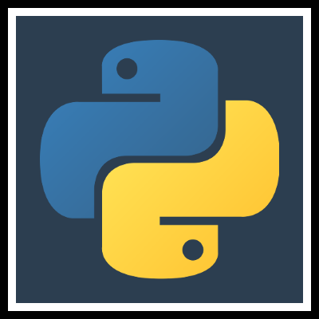

# Python Course

# Considerations
- Identation
- Case Sensitive

# Tools for this course
- Python3
- pip3
- Ipython
  - pip install ipython
- [Atom Editor](https://atom.io/)
- [platform io terminal](https://atom.io/packages/platformio-ide-terminal)
- [Jupyter](http://jupyter.org)
  - to execute cd to jupyter-notes/ folder and execute: `jupyter notebook`

# Another Packages distributions
- [continuum.io](continuum.io)
- [Enthought Canopy Express](https://www.enthought.com/product/canopy)
- [Python(x, y)](https://python-xy.github.io/)

# Usefull Commands
- python3 -V
- `python` or `idle3`  
- `python myfile.py >> result.txt`
- python operadores.py
- exit() , CTRL + D
- Program: hello.py

# Installing
- Installating Python (windows, mac, linux)
- IDLE
